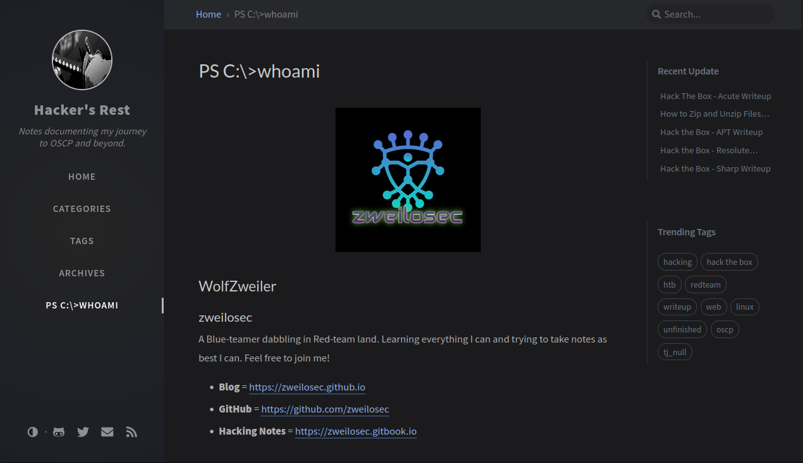
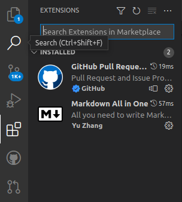
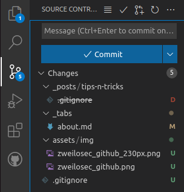
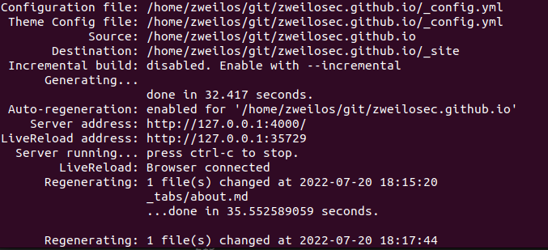

I meant to publish these instructions for myself when I first moved over to jekyll and Github Pages for hosting for posterity, but now I have to rebuild my development VM...and I have forgotten how to locally host my site again!  This was a good exercise, and now I have documentation.

### The Chirpy theme



This great looking theme (that this website uses!) has many great features as can be seen below:

#### Features
* Localized Layout
* Dark/Light Theme Mode
* Pinned Posts
* Hierarchical Categories
* Last Modified Date for Posts
* Table of Contents
* Auto-generated Related Posts
* Syntax Highlighting
* Mathematical Expressions
* Mermaid Diagram & Flowchart
* Disqus/Utterances/Giscus Comments
* Search
* Atom Feeds
* Google Analytics
* GA Pageviews Reporting
* SEO & Performance Optimization

## Step 1 - Prerequisites

Before building the website, your development machine needs to be set up to host and run [Jekyll](https://jekyllrb.com/) and [Git](https://git-scm.com/).  I also personally use and recommend [Visual Studio Code](https://code.visualstudio.com/) to do your actual writing and publishing as it is very simple to use.  

This tutorial assumes you are using Ubuntu, or other Debian-based Linux distribution.  Instructions may vary slightly for other operating systems.

### Ruby

The following must be installed first:

* Ruby version 2.5.0 or higher, including all development headers (check your Ruby version using `ruby -v`)
```bash
sudo apt install ruby-full build-essential zlib1g-dev
```
* RubyGems (should be included with Ruby, check your Gems version using `gem -v`)
* GCC and Make (should be included in your linux distro, check versions using `gcc -v`,`g++ -v`, and `make -v`)

Next, add the requisite lines to your `.bashrc` file by running each command below:

```bash
echo '# Install Ruby Gems to ~/gems' >> ~/.bashrc
echo 'export GEM_HOME="$HOME/gems"' >> ~/.bashrc
echo 'export PATH="$HOME/gems/bin:$PATH"' >> ~/.bashrc
source ~/.bashrc
```

### Jekyll

Next, install Jekyll and Bundler

```
gem install jekyll bundler
```

#### Blog Migrations

If you’re switching to Jekyll from another blogging system, Jekyll’s importers can help you with the move. To learn more about importing your site to Jekyll, visit the [jekyll-import](https://import.jekyllrb.com/docs/home/) docs site.

### Git

You will want to publish your updates to your website semi-automatically through Git rather than copying all changes to the GitHub website.  This will allow you to trigger the automatic build Actions built into GitHub Pages and Jekyll.

```
sudo apt install Git
```

You will also need to add your username and email to Git with the following commands:

```bash
git config --global user.name githubUsername
git config --global user.email your@email.address
```

### Visual Studio Code (optional)

1. First, install Visual Studio Code from the Snap store (included in Ubuntu).

```bash
sudo snap install --classic code
```



2. After installation you will want to install the two extensions `Markdown All in One` and `GitHub Pull Requests and Issues`.  These will enable you to edit your document as Markdown with syntax highlighting, and publish your page to GitHub, respectively.  

3. To enable the GitHub integration you will need to click on the new GitHub icon that has appeared on the left-side bar, then click the button to sign in.  
4. A browser window will open asking you to authorize the connection.  Sign in and allow the request.

## Step 2 - Forking Chirpy from GitHub

Create a new repository by forking the [chirpy-starter](https://github.com/cotes2020/chirpy-starter/generate) repository and naming it `<UserName>.github.io`, using your GitHub username in place of `<UserName>`.  

## Step 3 - Git Clone your repository

Next you will need to clone your repository to your dev machine.  Change directories to the location you want your site's files to exist (I created a folder called git in my user's home folder), then type the following command.

```bash
git clone https://github.com/<your repository name>
```

This copies all of the files from GitHub to your local machine and sets them up for git to use.

## Step 4 - Site configuration

### _config.yml

Update the variables of your site's configuration file `_config.yml` as needed. Most of the items are either self-explanatory, or have instructions next to them.  Some of them are typical options that you should configure are: (example information from my site below)

```yml
title: Hacker's Rest                           # the main title

tagline: Notes documenting my journey to OSCP and beyond.   # it will display as the sub-title

description: >-                        # used by seo meta and the atom feed
  A place for hackers, penetration testers,
  red-teamers, blue-teamers, and cyber security
  professionals of all kinds to learn and share ideas.
url: 'https://zweilosec.github.io'
github:
  username: zweilosec             # change to your github username

twitter:
  username: zweilosec            # change to your twitter username
avatar: /assets/img/avatar/your_avatar
timezone: US/Chicago
lang: en-US
theme_mode:  # [light|dark]
```

If you choose either light or dark for the `theme_mode`, the site will be permanently set that way.  If you do not choose, the site visitor can select which they prefer.

### .gitignore

Create a file called `.gitignore` in the root of your project folder to prevent Git from trying to sync these files.  Below are the recommended files and folders to ignore for a Jenkyll based page.  

```
_site/
.sass-cache/
.jekyll-cache/
.jekyll-metadata
# Ignore folders generated by Bundler
.bundle/
vendor/
```

## Step 5 - Pushing your code to GitHub



Git will track all of the changes you make to documents in your project folder, or as you upload images to the `assets/img/` folder.  You should see a number (5 in my screenshot) showing the number of changes to be pushed.

1. In order to push these changes up to GitHub select the `Change Control` icon on the left side.  This will bring up a view of all of the changes that have been tracked.  In the screenshot above you can see that I modified my `about.md`, uploaded three new images, and added a `.gitignore` file.  
3. Next, type a short (less than 50 characters) description of the changes you are making.  
4. To push these changes to GitHub you will need to hover over each item and click the small `+` icon next them.  You can also click the `+` icon next to a folder to accept all changes for files in that folder.  To accept all changes at once, click the `+` next to the `Changes` folder.  
5. Click the Commit button to submit all accepted changes to GitHub.
6. Click the same button again (Sync Changes)
7. On your GitHub repository, check the `Actions` tab to see the build process.  This will start automatically after pushing changes.  
8. After the build finishes successfully, navigate to the url of your site to view your shiny new blog!

## Testing your site on a Local Server

You may want to preview the changes you make to site contents before publishing.  Jekyll allows this by running a locally hosted webserver.  I highly recommend doing this before pushing changes to your live website in order to save yourself trouble caused by typos or other issues!

### Run from the terminal

Run the following command in the root directory of the site:

```bash
bundle exec jekyll serve
```

This will run jekyll using the version specified in the GemFile.  You can also just run `jekyll serve` but this may run into dependency issues.

### Run with Docker

You can also host the local website from a Docker container with the following command:

```bash
docker run -it --rm \
    --volume="$PWD:/srv/jekyll" \
    -p 4000:4000 jekyll/jekyll \
    jekyll serve
```

### Viewing the local webpage

After a short time (around 30 seconds for my site) the local service will be published and can be viewed in a browser at http://127.0.0.1:4000.

### --livereload

If you want to see your changes in (almost) real-time, you can use the `--livereload` flag to cause Jekyll to regenerate the pages you make changes to every time you save a document or upload new files to tracked folders.  Again, this takes around 30 seconds for my site on my dev machine.

```bash
jekyll serve --livereload
```



If there’s a conflict or you’d like Jekyll to serve your development site at a different URL, use the `--host` and `--port` arguments, as described in the [serve command options](https://jekyllrb.com/docs/configuration/options/#serve-command-options) page from the Jekyll documentation.

## Updating Jekyll

If you followed the earlier setup recommendations and installed Bundler, you can update Jekyll by simply running `bundle update jekyll`, or run `bundle update` and all your gems will updated to the latest versions.

## Troubleshooting

### webrick error

I got the following error while trying to run `jekyll server` : 

> cannot load such file -- **webrick (LoadError)**

To fix this I did the following:

1. Updated `github-pages`, `jekyll`, and `jekyll-feed` gems by running `gem install github-pages`, `gem install jekyll`, and `gem install jekyll-feed`. I had to do this step as a simple `bundle update` wasn't installing the latest version.
2. Run `bundle update` and `gem update`
3. Finally run `jekyll serve`

## References

* https://github.com/cotes2020/jekyll-theme-chirpy#documentation
* https://jekyllrb.com/docs/installation/ubuntu/
* https://stackoverflow.com/questions/65989040/bundle-exec-jekyll-serve-cannot-load-such-file
* https://www.michaelcrump.net/running-jekyll-locally/

If you have comments, issues, or other feedback, or have any other fun or useful tips or tricks to share, feel free to contact me on Github at [https://github.com/zweilosec](https://github.com/zweilosec) or in the comments below!

If you like this content and would like to see more, please consider buying me a coffee! <a href="https://www.buymeacoffee.com/zweilosec"></a>